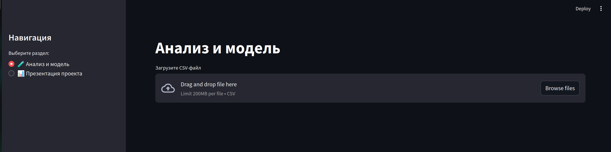

# 🔧 Проект: Предиктивное обслуживание оборудования

Машинное обучение для прогнозирования отказов промышленного оборудования с помощью бинарной классификации. Результат представлен в виде интерактивного веб-приложения на Streamlit.

---

## 🎯 Цель проекта

Разработать модель, способную предсказать возможный **отказ оборудования** (`Machine failure = 1`) на основе данных с датчиков.  
Приложение позволяет:
- загружать CSV-файлы;
- обучать модель;
- визуализировать метрики;
- делать прогнозы на новых данных.

---

## 📊 Описание датасета

- **Источник:** [UCI AI4I 2020 Predictive Maintenance Dataset](https://archive.ics.uci.edu/dataset/601/predictive+maintenance+dataset)
- **Объём:** 10 000 записей
- **Формат:** CSV
- **Целевая переменная:** `Machine failure` (0 — нет отказа, 1 — отказ)
- **Признаки:**
  - Температура воздуха и процесса
  - Скорость вращения
  - Крутящий момент
  - Износ инструмента
  - Тип оборудования (`L`, `M`, `H`)

---

## 🧠 Используемая модель

- **Алгоритм:** `Random Forest Classifier`
- **Метрики качества:**
  - `Accuracy`
  - `ROC-AUC`
  - `Confusion Matrix`
- **Предобработка:**
  - Удалены неинформативные признаки: `UDI`, `Product ID`, `TWF`, `HDF`, ...
  - Признак `Type` закодирован (L → 0, M → 1, H → 2)
  - Числовые признаки масштабированы с помощью `StandardScaler`

---

## 🖥 Интерфейс Streamlit-приложения



**Возможности:**
- Интерактивный анализ и обучение модели
- Визуализация метрик (Accuracy, ROC-AUC, матрица ошибок)
- Форма ввода параметров для прогноза
- Автоматическая презентация слайдов проекта

---
## 🎥 Видео-демонстрация

- ▶️ [Смотреть на Google Диске]([https://drive.google.com/file/d/ВАШ_ID_ЗДЕСЬ/view](https://drive.google.com/file/d/1hioSqVlcDc8s77SdFCgAIbfbRyb5FSQl/view?usp=sharing))
- 📁 [Локальное видео (demo.mp4)](video/demo.mp4)

<video src="video/demo.mp4" controls width="100%"></video>

## 🚀 Установка и запуск

```bash
git clone https://github.com/Ju1ce13/Data-Science.git
cd predictive_maintenance
pip install -r requirements.txt
streamlit run app.py

